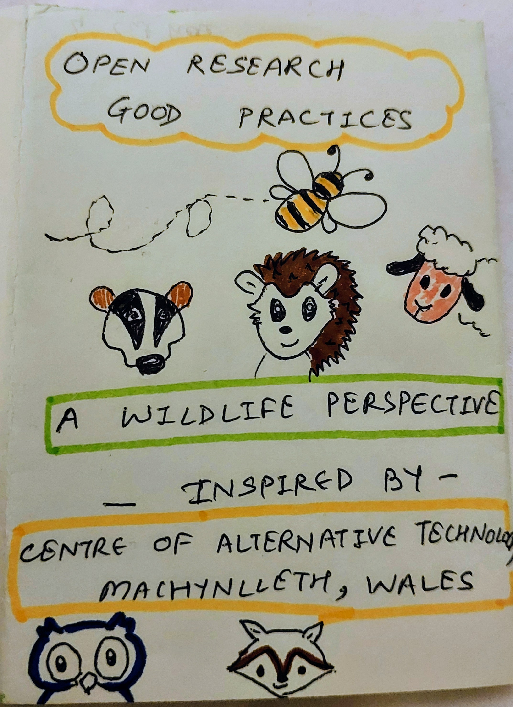
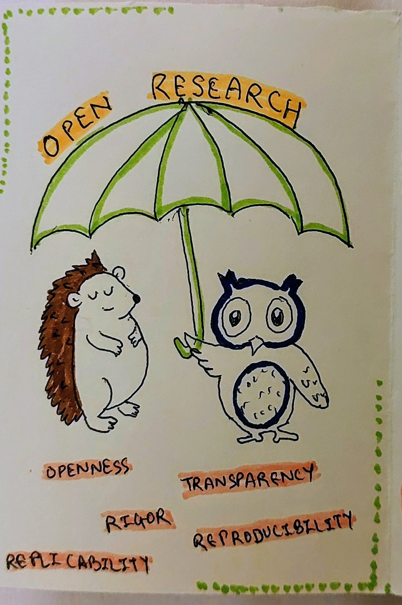
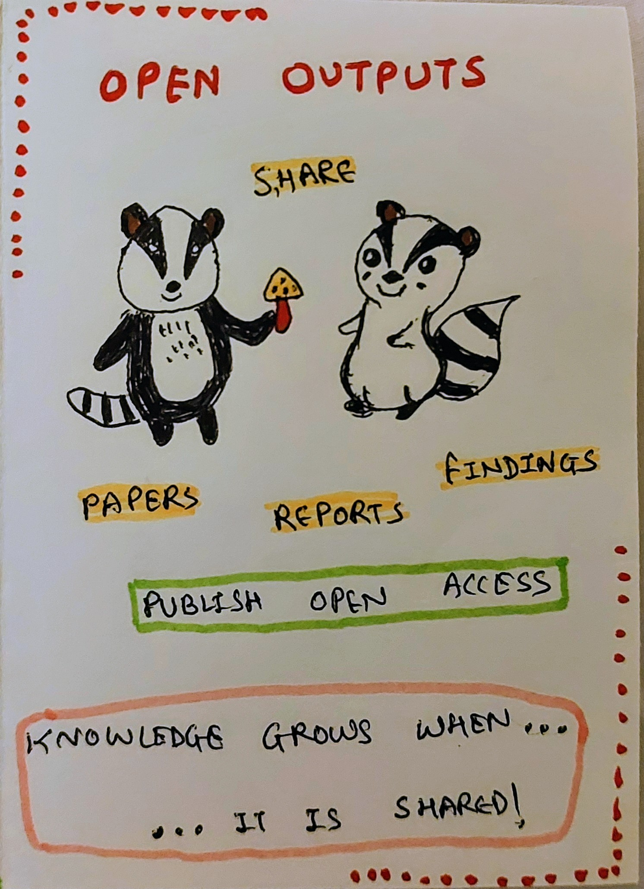
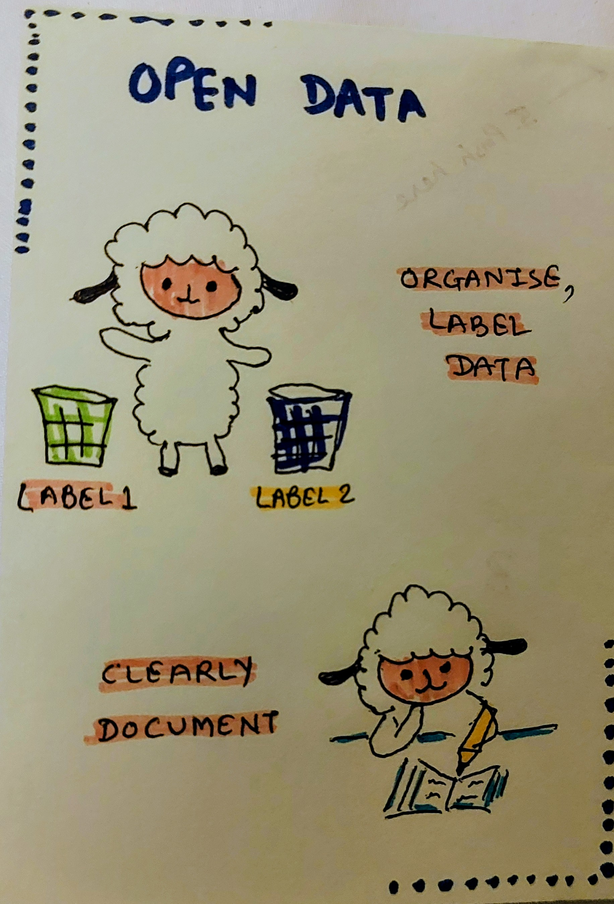
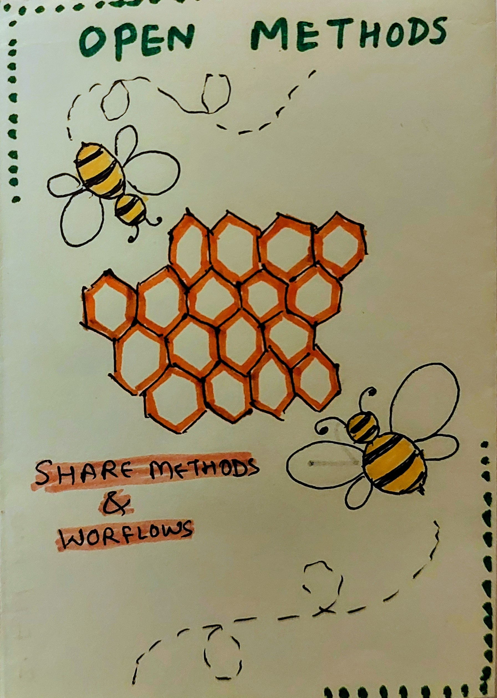
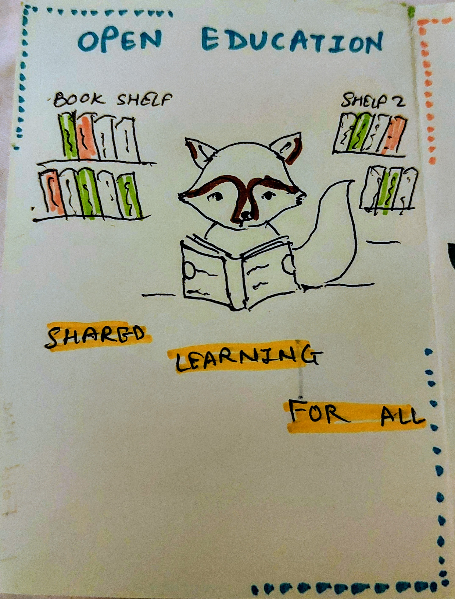
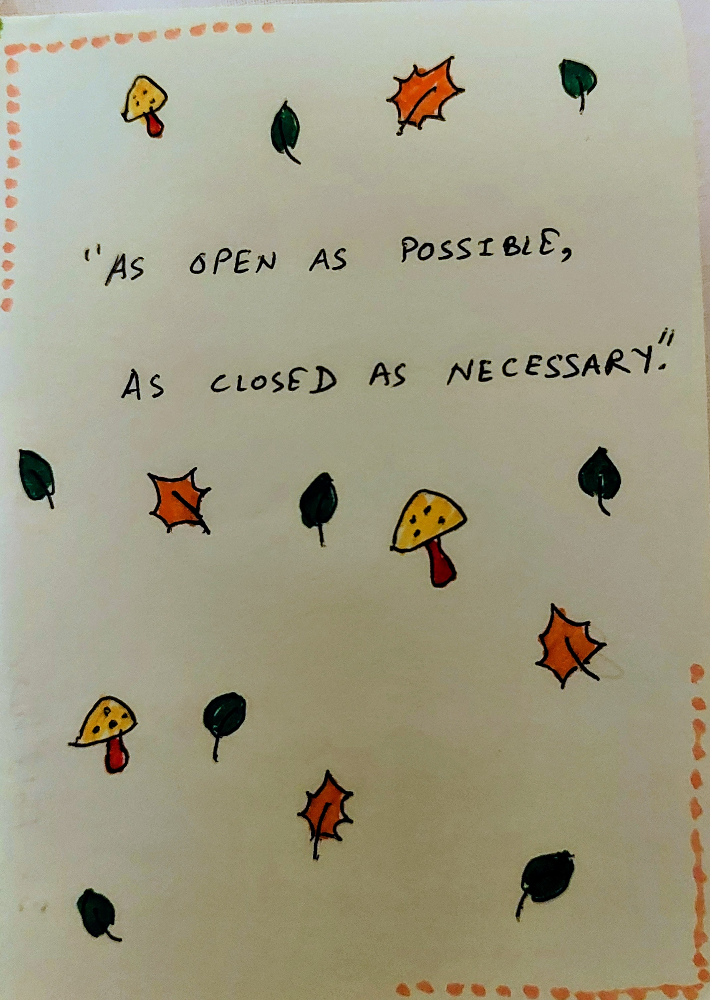
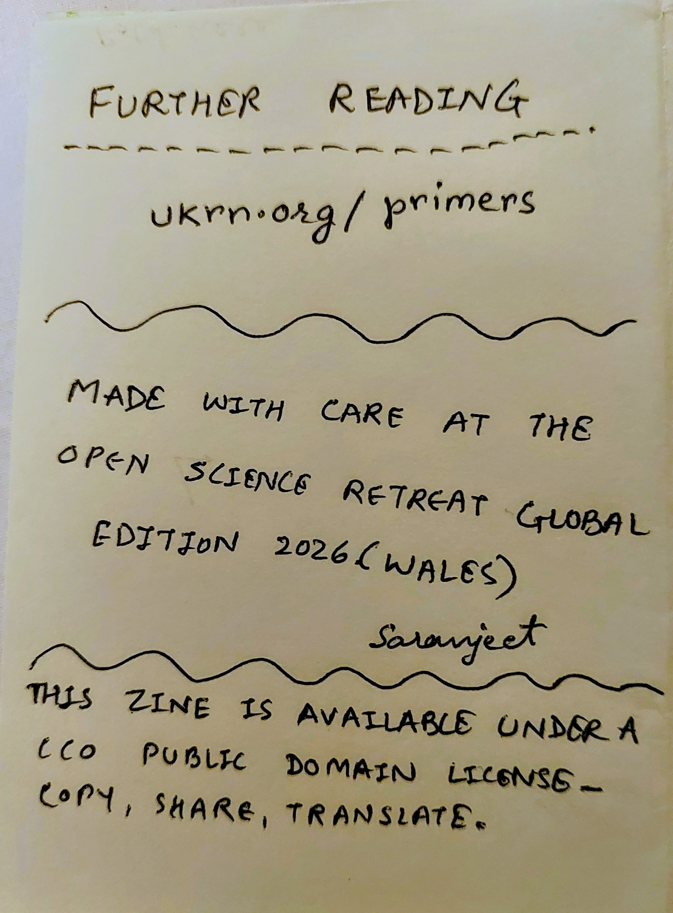

:::{.cr-section layout="sidebar-right"}
**_Open Research Good Practices_**  [@cr-intro]{pan-to="0%,-23%"  scale-by="0.55"}

_Open Science Retreat Global Edition 2026_  [@cr-intro]{pan-to="0%,-23%"  scale-by="0.55"}

:::{#cr-intro}

:::
:::

:::{.cr-section layout="sidebar-left"}
**_The Open Research Umbrella_**  [@cr-umbrella]{pan-to="0%,-24.5%"  scale-by="0.5"}

:::{#cr-umbrella}

:::
:::

:::{.cr-section layout="sidebar-right"}
**_Open Outputs_**  [@cr-outputs]{pan-to="0%,-22.5%"  scale-by="0.55"}

:::{#cr-outputs}

:::
:::

:::{.cr-section layout="sidebar-left"}
**_Open Data_**  [@cr-data]{pan-to="0%,-24.5%"  scale-by="0.5"}

:::{#cr-data}

:::
:::

:::{.cr-section layout="sidebar-right"}
**_Open Methods_**  [@cr-methods]{pan-to="0%,-23%"  scale-by="0.52"}

:::{#cr-methods}

:::
:::

:::{.cr-section layout="sidebar-left"}
**_Open Education_**  [@cr-education]{pan-to="0%,-22%"  scale-by="0.55"}

:::{#cr-education}

:::
:::

:::{.cr-section layout="sidebar-right"}
**_As open ..., as closed ..._**  [@cr-quote]{pan-to="0%,-23%"  scale-by="0.53"}

:::{#cr-quote}

:::
:::

:::{.cr-section layout="sidebar-left}"}
**_Further reading_**  [@cr-reference]{pan-to="0%,-23%"  scale-by="0.5"}

:::{#cr-reference}

:::
:::
